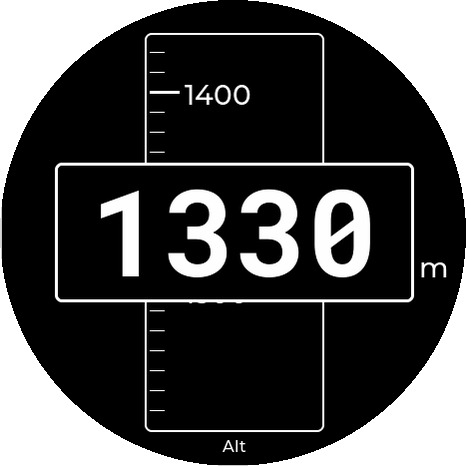
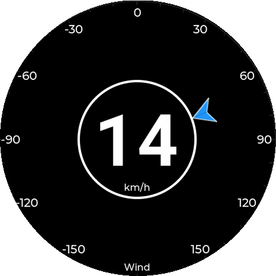

# Flaps & Speed Display User Manual

**Document version:** 1.0  
**Date:** 22.03.2026

## Purpose

The **Flaps & Speed Display** is a touchscreen flight display for the ESP32-S3 AMOLED unit. It receives live data from the CAN bus and shows:

- indicated airspeed (IAS)
- current flap setting
- recommended flap setting
- flight altitude
- wind information (speed and relative direction)
- display brightness settings

The display is controlled entirely by touch gestures and on-screen buttons.

## Startup

After power-up, the unit shows a short splash screen with:

- application name
- firmware version
- git revision

It then switches to the normal operating screens.

## Touch Navigation

The display has six screens. Navigation is done with swipe gestures:

- **Swipe up or down**: cycle between the four main flying screens (Speed, Flaps, Altitude, Wind)
- **Swipe right**: open the settings/detail screens
- **Swipe right again**: switch between the two settings/detail screens
- **Swipe left**: return from the settings/detail screens to the main flying screen

## Screen Overview

### 1. Flaps Screen

This screen combines airspeed with flap guidance.

- The large text in the center is the **actual flap position symbol**
- The white pointer still shows **IAS**
- The green arc marks the valid speed bands for the flap schedule
- The highlighted arc segment shows the **target flap range**
- The white triangle indicates the correction direction:
  - triangle above: select a **higher** flap setting
  - triangle below: select a **lower** flap setting
  - no triangle: actual and target flap settings match

Typical flap symbols are `L`, `+2`, `+1`, `0`, `-1`, `-2`, `S`, and `S1`.

The current configuration also defines a special **lowspeed** setting in [`spiffs_data/flapDescriptor.json`](/media/andreas/data2/workspace2/Flaps_and_Speed_Display/spiffs_data/flapDescriptor.json):

- flap setting: `-1`
- speed range: `0 to 40 km/h`

This lowspeed setting is intended for takeoff and landing and is handled separately from the normal flap speed bands.

### 2. Speed Screen

This is the airspeed display.

- The large number in the center is the **indicated airspeed** in **km/h**
- The white pointer shows the same IAS on the circular scale
- The scale range is **40 to 280 km/h**
- The pointer movement is intentionally damped for stable, instrument-like motion

Use this screen when you want the clearest possible IAS indication.

### 3. Altitude Screen

This screen displays the current flight altitude.

- The large number in the center is the **altitude** in **meters**
- The moving tape in the center provides a visual representation of altitude changes
- The tape has major markings every **100 meters** and minor markings every **10 meters**
- The current altitude is also shown as a digital value in the center box for better readability

### 4. Wind Screen

This screen displays the current wind information relative to the aircraft's heading.

- The large number in the center is the **wind speed** in **km/h**
- The blue arrow on the circular scale shows the **relative wind direction**
- The scale range is **-180° to +180°** (0° is straight ahead)
- The arrow points in the direction the wind is coming from relative to the nose of the aircraft

### 5. Live Params Screen

This screen shows the values used internally for flap guidance and navigation.

- **IAS**: indicated airspeed in km/h
- **Weight**: current flying weight used for the flap calculation
- **Flap Actual**: current detected flap symbol and index
- **Flap Target**: recommended flap symbol and index
- **Alt**: current altitude in meters
- **HDG**: current heading in degrees
- **Wind**: wind speed and absolute direction
- **GS**: ground speed in km/h
- **TRK**: GPS true track in degrees

This is the best screen for troubleshooting or checking why a flap recommendation or wind calculation is being made.

### 6. Settings / Brightness Screen

This screen is used to adjust the display brightness.

- Press `+` to increase brightness
- Press `-` to decrease brightness

Brightness changes in **10% steps**.

- minimum brightness: **30%**
- maximum brightness: **100%**
## How Flap Guidance Works

The unit compares:

- current IAS from CAN bus data
- current flap position from CAN bus data
- current weight from CAN bus data
- the configured flap schedule in [`spiffs_data/flapDescriptor.json`](/media/andreas/data2/workspace2/Flaps_and_Speed_Display/spiffs_data/flapDescriptor.json)

## Stale Data Indication

If no relevant live data is received for **10 seconds**, the display marks the active flying screen as stale.

The stale condition is shown by a large **red X** across the active screen.

This indicates that the shown IAS/flap information should no longer be trusted until valid CAN data is received again.

## Normal Use

1. Power on the unit.
2. Wait until the splash screen finishes.
3. Use the **Speed** screen for normal IAS monitoring.
4. Swipe to the **Flaps** screen when flap guidance is needed.
5. Swipe to the **Altitude** screen for height monitoring.
6. Swipe to the **Wind** screen to check wind conditions.
7. Open **Live Params** if you want to verify internal values.
8. Open **Settings** to adjust brightness for cockpit conditions.

## Notes

- All speed values are displayed in **km/h**
- Flap recommendations depend on the flap polar stored in the JSON configuration
- If flap input data does not match a known position, the flap indication may show no valid symbol
- The current `flapDescriptor` and the guidance described in this manual are based on the Ventus 3 reference shown below
- 
